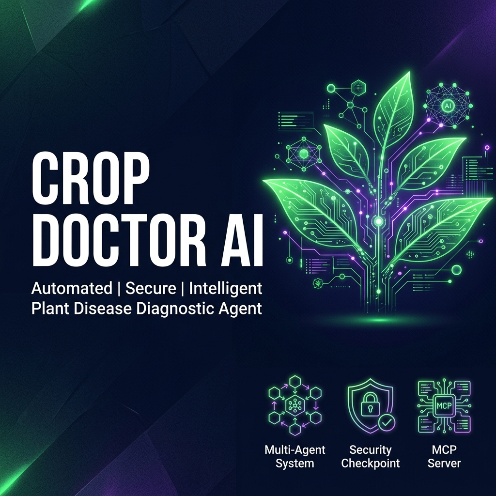
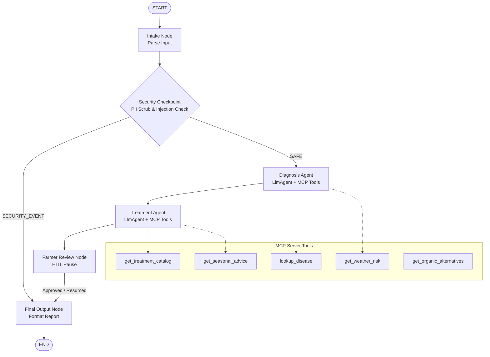
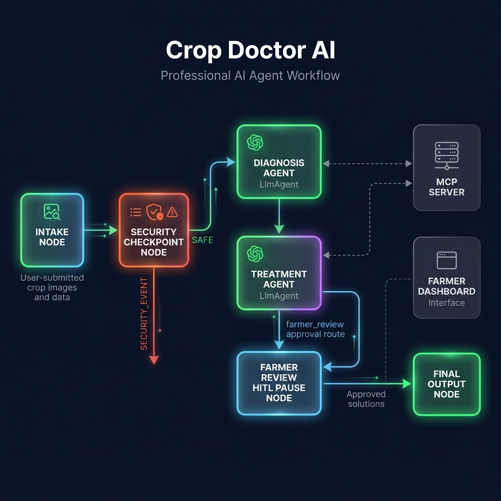

# 🌿 Crop Doctor AI



Crop Doctor AI is an advanced, secure multi-agent plant pathologist and diagnostic system built using the **Gemini Agent Development Kit (ADK) 2.0**. It helps farmers identify plant diseases early from symptom descriptions, assess risk levels based on live weather data, and obtain customized organic and chemical treatment plans.

---

## 📐 Agent Workflow Architecture

The agent is designed as an event-driven workflow graph containing specialized agents, security guardrails, and MCP toolsets:



### Workflow Nodes & Actions
1. **Intake Node**: Extracts symptoms, crop type, farming region, season, and optional farmer contact details.
2. **Security Checkpoint**: Redacts PII (Emails, Phones, Aadhaar numbers, GPS coordinates) and detects malicious inputs (Prompt Injections or non-agricultural keywords).
3. **Diagnosis Agent**: Connects to the **MCP Server** to query weather risk indexes and disease descriptions to determine the plant pathology report.
4. **Treatment Agent**: Recommends step-by-step treatment workflows prioritizing organic/natural options, safety warnings, and recovery timelines.
5. **Farmer Review (HITL)**: Pauses execution to request the farmer's explicit review and approval of the generated plan.
6. **Final Output Node**: Formats the comprehensive audit logs and report.



---

## 📂 Project Structure

```
crop-doctor-agent/
├── app/
│   ├── templates/
│   │   └── index.html         # Interactive web dashboard (HTML/JS)
│   ├── agent.py               # Workflow graph & specialized agents
│   ├── config.py              # Configuration & Environment loading
│   ├── mcp_server.py          # Model Context Protocol (MCP) server
│   └── web_server.py          # FastAPI server bridging ADK & UI
├── assets/
│   ├── architecture_diagram.png
│   └── cover_page_banner.png
├── DEMO_SCRIPT.txt            # Verbal presentation script (Phase 8)
├── SUBMISSION_WRITEUP.md      # Solution architecture & details (Phase 6b)
├── Makefile                   # Local task automation
├── README.md                  # Project Quick Start
└── pyproject.toml             # Python dependencies
```

---

## ⚡ Quick Start

### 1. Configure Environment
Create a `.env` file in the `crop-doctor-agent/` directory:
```env
GOOGLE_API_KEY=your_gemini_api_key
GOOGLE_GENAI_USE_VERTEXAI=False
GEMINI_MODEL=gemini-2.5-flash
```

### 2. Install Dependencies
Make sure you have `uv` installed, then run:
```bash
uv sync
```

### 3. Launch the Server
To start the FastAPI web server & dashboard:
```bash
uv run python -m app.web_server
```
Open your browser and navigate to **[http://127.0.0.1:8080](http://127.0.0.1:8080)**.

---

## 🛠️ MCP Server Tools
The integrated Model Context Protocol (MCP) server runs locally as a subprocess and exposes the following tools:
* `lookup_disease`: Retrieve detailed pathology specs from the disease database.
* `get_treatment_catalog`: Find recommended cures, safety steps, and recovery times.
* `get_weather_risk`: Check disease pressure indices (High/Medium/Low) based on region & season.
* `get_seasonal_advice`: Obtain best practices, spacing, and watering checklists.
* `get_organic_alternatives`: Look up organic replacements for common chemical pesticides.
